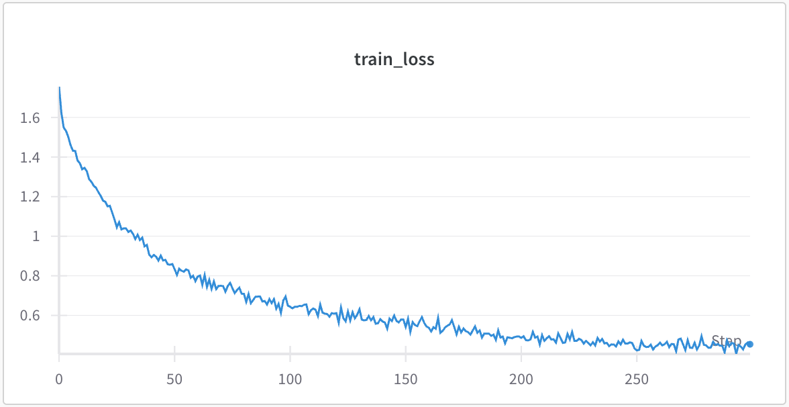

# **Lab Assignment 2 - Food Image Classification with CNNs**

2021312660 Jinwoong Jung(Department of Applied Artificial Intelligence, SKKU)

## Abstract

This report presents the solution to the Lab Assignment 2 of the course ‘Introduction to Deep Learning(AAI_3010_01)’, which aims to classify real-world food images into 11 distinct categories using Convolutional Neural Networks (CNNs). To improve model generalization and robustness, a variety of techniques were applied, including advanced data augmentation, Label Smoothing, Focal Loss, Sharpness-Aware Minimization (SAM), and Cosine Annealing Learning Rate Scheduler. The model was implemented using a ResNet34 architecture, without pre-trained weights. Through extensive experimentation and hyperparameter tuning, the final model achieved a test accuracy of 0.87129, demonstrating its effectiveness on the given classification task.

## 1. Overview

The objective of this assignment is to classify real-world food images into 11 predefined categories using Convolutional Neural Networks (CNNs). Through this task, the following learning outcomes are expected:

- Gain hands-on experience with CNN architectures
- Understand the process of training and optimizing Deep Learning models
- Learn to improve model performance through various techniques
- Practice working with real-world image datasets

Two model selection options were provided for the assignment:

- Option 1: Develop my own model based on provided model
- Option 2: Use defined models.

In this project, I selected **Option 2**, employing the **ResNet34** architecture from the `torchvision.models` library. Importantly, the model was initialized **without pre-trained weights**(`weights=None`), enabling training from scratch on the target dataset. This decision was made to better control feature learning specific to the dataset and avoid biases introduced by external datasets such as ImageNet.

## 2. Dataset

The dataset consists of a total of **13,296 real-world food images**, each belonging to one of **11 food categories**, labeled from 0 to 10. The dataset is organized into three subsets:

- **Training set**:
    - Contains **7,977** images.
    - Each image is named in the format `"x_y.png"`, where `x` denotes the class label (0–10), and `y` represents a unique ID.
- **Validation set**:
    - Contains **2,659** images.
    - Follows the same filename format as the training set.
- **Test set**:
    - Contains **2,660** images.
    - Filenames follow the format `"y.png"` without any label information.
    - The goal is to predict the class label for each image.

## 3. Method

In this section, I describe the methods and models applied to improve the performance of the image classification task. I provide an overview of the techniques used, explain the choice of model architecture, and include code snippets with detailed explanations of each applied method.

### 3-1. Test Time Augmentation(TTA)

```python
mean = [0.5554, 0.4511, 0.3440]
std = [0.2308, 0.2415, 0.2404]

tta_transforms = [
    transforms.Compose([
        transforms.Resize((256, 256)),
        transforms.ToTensor(),
        transforms.Normalize(mean=mean, std=std)
    ]),
    transforms.Compose([
        transforms.Resize((256, 256)),
        transforms.RandomHorizontalFlip(),
        transforms.ToTensor(),
        transforms.Normalize(mean=mean, std=std)
    ]),
    transforms.Compose([
        transforms.Resize((256, 256)),
        transforms.RandomRotation(10),
        transforms.ToTensor(),
        transforms.Normalize(mean=mean, std=std)
    ]),
    transforms.Compose([
        transforms.Resize((256, 256)),
        transforms.ColorJitter(brightness=0.2, contrast=0.2, saturation=0.2, hue=0.1),
        transforms.ToTensor(),
        transforms.Normalize(mean=mean, std=std)
    ]),
    transforms.Compose([
        transforms.Resize((256, 256)),
        transforms.RandomAffine(degrees=10, translate=(0.05, 0.05), scale=(0.90, 1.10)),
        transforms.ToTensor(),
        transforms.Normalize(mean=mean, std=std)
    ]),
    transforms.Compose([
        transforms.Resize((256, 256)),
        transforms.GaussianBlur(kernel_size=5, sigma=(0.1, 2.0)),
        transforms.ToTensor(),
        transforms.Normalize(mean=mean, std=std)
    ]),
]
```

Test Time Augmentation (TTA) is a technique applied during the inference phase, where multiple augmented versions of a test image are generated, and the model makes predictions for each version. The final prediction is obtained by aggregating these results, typically through averaging or voting mechanisms. This approach extends the concept of data augmentation used during training to the testing phase, aiming to enhance the model's generalization performance.

Common augmentations include horizontal/vertical flips, and rotations. Normalization is performed using the dataset-specific mean and standard deviation values. TTA is particularly effective in computer vision tasks such as image classification, object detection, and segmentation, providing more stable and reliable predictions.

**Advantages**:

- Improves robustness of model predictions
- Reduces sensitivity to data bias

**Disadvantages**:

- Increases inference time
- May not be effective for all types of tasks

### 3-2. Data Augmentation

```python
train_tfm = transforms.Compose([
    transforms.RandomResizedCrop(256, scale=(0.8, 1.0)),
    transforms.RandomHorizontalFlip(),
    transforms.RandomRotation(10),
    transforms.ColorJitter(brightness=0.1, contrast=0.1, saturation=0.1),
    transforms.RandomAffine(degrees=10, translate=(0.05, 0.05), scale=(0.9, 1.1)),
    transforms.Resize((256, 256)),
    transforms.ToTensor(),
    transforms.Normalize(mean=mean, std=std)
])

valid_tfm = transforms.Compose([
    transforms.Resize((256, 256)),
    transforms.ToTensor(),
    transforms.Normalize(mean=mean, std=std)
])
```

Different data transformation pipelines are defined for training and validation stages using `torchvision.transforms`.

- `train_tfm` applies a series of data augmentation techniques to increase data diversity and improve generalization. These include random cropping, horizontal flipping, rotation, color jittering, affine transformations, resizing, tensor conversion, and normalization.
- `valid_tfm` use a simpler pipeline without augmentation. Both apply only resizing, tensor conversion, and normalization to ensure consistent evaluation across models.

Normalization is performed using the dataset-specific mean and standard deviation values.

This setup ensures that the training process benefits from diverse data, while validation maintain a stable input format for reliable performance measurement.

### 3-3. Model

```python
class Classifier(nn.Module):
    def __init__(self):
        super(Classifier, self).__init__()
        self.backbone = models.resnet34(weights=None)
        in_features = self.backbone.fc.in_features
        self.backbone.fc = nn.Sequential(
            nn.Dropout(0.5),
            nn.Linear(in_features, 11)
        )

    def forward(self, x):
        return self.backbone(x)
```

The model used in this project is a custom image classifier built upon the ResNet-34 architecture. **ResNet(Residual Network)** is a deep convolutional neural network architecture introduced by Microsoft Research in 2015. It addresses the **vanishing gradient problem** commonly found in very deep networks by introducing **residual connections**, also known as skip connections. The core structure is defined as follows:

- **Backbone**: A ResNet-34 model from `torchvision.models` is used as the feature extractor. The `weights=None` argument indicates that no pre-trained weights are loaded, and the model is trained from scratch.
- **Output Layer Modification**:
    
    The original fully connected (FC) layer of ResNet-34 is replaced with a new sequential layer composed of:
    
    - `Dropout(0.5)`: Helps prevent overfitting by randomly setting 50% of the features to zero during training.
    - `Linear(in_features, 11)`: A fully connected layer mapping the extracted features to 11 output classes, corresponding to the number of target categories in the dataset.
- **Forward Pass**:
    
    The input image tensor is passed through the modified ResNet-34 backbone, and the output is a vector of size 11 representing class scores.
    

### 3-4. Label Smoothing + Focal Loss

```python
class LabelSmoothingFocalLoss(nn.Module):
    def __init__(self, gamma=2.0, alpha=1.0, smoothing=0.1, reduction='mean'):
        super().__init__()
        self.gamma = gamma
        self.alpha = alpha
        self.smoothing = smoothing
        self.reduction = reduction
    def forward(self, logits, target):
        num_classes = logits.size(1)
        with torch.no_grad():
            true_dist = torch.zeros_like(logits)
            true_dist.fill_(self.smoothing / (num_classes - 1))
            true_dist.scatter_(1, target.data.unsqueeze(1), 1.0 - self.smoothing)
        log_probs = F.log_softmax(logits, dim=1)
        probs = torch.exp(log_probs)
        focal_factor = (1 - probs).pow(self.gamma)
        loss = -self.alpha * focal_factor * true_dist * log_probs
        loss = loss.sum(dim=1)
        if self.reduction == 'mean':
            return loss.mean()
        elif self.reduction == 'sum':
            return loss.sum()
        else:
            return loss
```

This custom loss function combines **Label Smoothing** and **Focal Loss**, two techniques designed to improve model generalization and robustness, especially in classification tasks with class imbalance or noisy labels.

**Label Smoothing**. Label Smoothing is a regularization technique used in classification tasks. Instead of using hard one-hot labels, it replaces the target distribution with a **softened version**, assigning a small probability to non-target classes. Label Smoothing softens the target distribution by distributing a small portion of the confidence to non-target classes, controlled by a `smoothing` parameter.

**Focal Loss**. Focal Loss is designed to address **class imbalance** in classification tasks. It down-weights the loss contribution of well-classified examples and focuses more on hard or misclassified examples. This reduces the impact of easy examples, and amplifies the contribution of hard examples(low confidence). Focal Loss modulates the standard cross-entropy loss using `gamma` to focus on hard examples and `alpha` to balance class importance.

### 3-5. Sharpness-Aware Minimization

```python
class SAM(torch.optim.Optimizer):
    def __init__(self, params, base_optimizer, rho=0.05, **kwargs):
        assert rho >= 0.0, f"Invalid rho, should be non-negative: {rho}"
        defaults = dict(rho=rho, **kwargs)
        super(SAM, self).__init__(params, defaults)
        self.base_optimizer = base_optimizer(self.param_groups, **kwargs)
        self.rho = rho
    @torch.no_grad()
    def first_step(self, zero_grad=False):
        grad_norm = self._grad_norm()
        scale = self.rho / (grad_norm + 1e-12)
        for group in self.param_groups:
            for p in group["params"]:
                if p.grad is None: continue
                e_w = p.grad * scale.to(p)
                p.add_(e_w)
                self.state[p]["e_w"] = e_w
        if zero_grad:
            self.zero_grad()
    @torch.no_grad()
    def second_step(self, zero_grad=False):
        for group in self.param_groups:
            for p in group["params"]:
                if p.grad is None: continue
                p.sub_(self.state[p]["e_w"])
        self.base_optimizer.step()
        if zero_grad:
            self.zero_grad()
    @torch.no_grad()
    def step(self, closure=None):
        assert closure is not None, "SAM requires closure, but it was not provided"
        closure = torch.enable_grad()(closure)
        loss = closure()
        self.first_step(zero_grad=True)
        closure()
        self.second_step(zero_grad=True)
    def _grad_norm(self):
        shared_device = self.param_groups[0]["params"][0].device
        norm = torch.norm(
            torch.stack([
                p.grad.norm(p=2).to(shared_device)
                for group in self.param_groups for p in group["params"]
                if p.grad is not None
            ]),
            p=2
        )
        return norm

base_optimizer = torch.optim.Adam
```

This code implements the **Sharpness-Aware Minimization (SAM)** optimizer, which improves model generalization by not only minimizing the loss, but also seeking parameter regions where the loss surface is **flat** and **stable**.

Key behaviors include:

- **first_step**: Applies a gradient-based perturbation to model parameters to explore the sharpness of the current loss landscape.
- **second_step**: Reverts the perturbation and performs the actual optimizer step using the base optimizer (e.g., Adam).
- **step**: Executes the two-phase SAM update by calling the closure function twice, once before and once after perturbation.

The `rho` parameter controls the radius of the perturbation applied during the sharpness estimation. This implementation wraps around `Adam` as the base optimizer.

## 4. Experiments

In this section, I explain how the techniques mentioned in Section 3 are implemented in the actual training code. I also describe any additional settings or implementation details applied during the training process. All experiments in this section were conducted using an NVIDIA RTX 3080 GPU with 10GB of memory.

### 4-1. Training Environment and Initial Setup

```python
parser = argparse.ArgumentParser()
parser.add_argument("--batch_size", type=int, default=32)
parser.add_argument("--lr", type=float, default=1e-3)
parser.add_argument("--n_epochs", type=int, default=300)
parser.add_argument("--patience", type=int, default=10)
parser.add_argument("--weight_decay", type=float, default=1e-4)
parser.add_argument("--eps", type=float, default=0.05)
parser.add_argument("--exp_name", type=str, default="food_classification")
parser.add_argument("--gamma", type=float, default=2.0)
parser.add_argument("--alpha", type=float, default=1.0)
args = parser.parse_args()

batch_size = args.batch_size
n_epochs = args.n_epochs
patience = args.patience
lr = args.lr
weight_decay = args.weight_decay
eps = args.eps
exp_name = args.exp_name
gamma = args.gamma
alpha = args.alpha
```

In this experiment, various hyper-parameters were defined and utilized via `argparse`, including batch size (`batch_size`), learning rate (`lr`), number of epochs (`n_epochs`), patience (`patience`), weight decay (`weight_decay`), label smoothing factor (`eps`), and parameters specific to Focal Loss (`gamma`, `alpha`). These values were fixed in the code and used consistently throughout training.

```nasm
_dataset_dir = "Assignment2_dataset/"
train_set = FoodDataset(os.path.join(_dataset_dir, "training dataset/train"), tfm=train_tfm)
train_loader = DataLoader(train_set, batch_size=batch_size, shuffle=True, num_workers=4, pin_memory=True)
valid_set = FoodDataset(os.path.join(_dataset_dir, "validation dataset/validation"), tfm=valid_tfm)
valid_loader = DataLoader(valid_set, batch_size=batch_size, shuffle=False, num_workers=4, pin_memory=True)
```

The dataset used in training was divided into training and validation sets, each loaded using the `FoodDataset` class and wrapped with PyTorch's `DataLoader`. To ensure randomness during training, the training loader was set with `shuffle=True`.

```python
optimizer = SAM(model.parameters(), base_optimizer, lr=lr, weight_decay=weight_decay)
criterion = LabelSmoothingFocalLoss(gamma=gamma, alpha=alpha, smoothing=eps)
scheduler = torch.optim.lr_scheduler.CosineAnnealingLR(optimizer, T_max=n_epochs, eta_min=1e-6)
```

To optimize the model, I employed the **Sharpness-Aware Minimization (SAM)** optimizer by wrapping it around the `Adam` base optimizer. SAM is designed to improve generalization by not only minimizing the training loss but also minimizing the sharpness of the loss landscape. It does so by perturbing the model parameters in the direction of the gradient (first step), then updating the parameters based on the perturbed loss (second step). This encourages the model to converge to flat minima, which are associated with better generalization on unseen data.

The **loss function** used is a combination of **Label Smoothing** and **Focal Loss**, implemented as a custom `LabelSmoothingFocalLoss` class. Label Smoothing reduces overconfidence by distributing some of the probability mass to non-target classes, which helps with regularization. Focal Loss, controlled by the `gamma` and `alpha` parameters, focuses training on hard-to-classify examples by down-weighting the loss for well-classified instances. This is particularly effective in handling class imbalance and improving robustness.

For **learning rate scheduling**, I used the `CosineAnnealingLR` scheduler, which gradually reduces the learning rate following a cosine curve over the training epochs. This allows the model to start with a relatively high learning rate and then anneal it smoothly towards a minimum value, helping the model converge more stably in later training stages. The `T_max=n_epochs` defines the number of epochs for one full cosine cycle, and `eta_min=1e-6` sets the minimum learning rate, preventing it from decreasing indefinitely.

### 4-2. Training & Validation

```python
def rand_bbox(size, lam):
    W = size[2]
    H = size[3]
    cut_rat = np.sqrt(1. - lam)
    cut_w = np.int32(W * cut_rat)
    cut_h = np.int32(H * cut_rat)
    cx = np.random.randint(W)
    cy = np.random.randint(H)
    bbx1 = np.clip(cx - cut_w // 2, 0, W)
    bby1 = np.clip(cy - cut_h // 2, 0, H)
    bbx2 = np.clip(cx + cut_w // 2, 0, W)
    bby2 = np.clip(cy + cut_h // 2, 0, H)
    return bbx1, bby1, bbx2, bby2
    
# ...existing code...

cutmix_prob = 0.5
r = np.random.rand(1)
if r < cutmix_prob:
    lam = np.random.beta(1.0, 1.0)
    rand_index = torch.randperm(imgs.size(0)).to(device)
    target_a = labels
    target_b = labels[rand_index]
		bbx1, bby1, bbx2, bby2 = rand_bbox(imgs.size(), lam)
                imgs[:, :, bbx1:bbx2, bby1:bby2] = imgs[rand_index, :, bbx1:bbx2, bby1:bby2]
		lam = 1 - ((bbx2 - bbx1) * (bby2 - bby1) / (imgs.size()[-1] * imgs.size()[-2]))
		logits = model(imgs)
		loss = lam * criterion(logits, target_a) + (1 - lam) * criterion(logits, target_b)
else:
		logits = model(imgs)
		loss = criterion(logits, labels)
```

To enhance data diversity during training, **CutMix augmentation** was optionally applied with a 50% probability (`cutmix_prob=0.5`). This technique replaces a random patch of an image with a patch from another image, and blends the corresponding labels proportionally. It helps improve model robustness by exposing it to mixed-class features.

```python
# SAM first step
optimizer.zero_grad()
loss.backward()
nn.utils.clip_grad_norm_(model.parameters(), max_norm=1.0)
optimizer.first_step(zero_grad=True)

# SAM second step
logits2 = model(imgs)
if r < cutmix_prob:
		loss2 = lam * criterion(logits2, target_a) + (1 - lam) * criterion(logits2, target_b)
else:
		loss2 = criterion(logits2, labels)
loss2.backward()
optimizer.second_step(zero_grad=True)

acc = (logits.argmax(dim=-1) == labels).float().mean()
train_loss.append(loss.item())
train_accs.append(acc.item())
```

During each training step, the model parameters are updated using the **two-step SAM optimization process**. In the first step, a perturbation is applied to the model weights in the gradient direction. After recomputing the loss with the perturbed parameters, the second step updates the weights to minimize the loss in that perturbed space. This approach encourages the model to converge to flatter and more generalizable solutions.

The **training loop** iterates over the dataset to compute the loss and accuracy for each batch. Gradients are clipped to stabilize training, and performance metrics are recorded for monitoring progress.

The **validation loop** evaluates the model without gradient updates, using the same loss function and accuracy metric. It helps monitor overfitting and determine when to reduce the learning rate.

```python
with open(f"./{_exp_name}_log.txt", "a") as f:
		if valid_acc_avg > best_acc:
				print(f"[ Valid | {epoch+1:03d}/{n_epochs:03d} ] loss = {valid_loss_avg:.5f}, \
							acc = {valid_acc_avg:.5f} -> best", file=f)
		else:
				print(f"[ Valid | {epoch+1:03d}/{n_epochs:03d} ] loss = {valid_loss_avg:.5f}, \
							acc = {valid_acc_avg:.5f}", file=f)

		if valid_acc_avg > best_acc:
				print(f"Best model found at epoch {epoch}, saving model")
				torch.save(model.state_dict(), f"{_exp_name}_best.ckpt")
				best_acc = valid_acc_avg

    scheduler.step()
```

Finally, if the validation accuracy improves, the model's parameters are saved as the best checkpoint. Training logs are written to a text file, and the learning rate scheduler is stepped.

### **4-3. Test**

```python
with torch.no_grad():
		# TTA for test dataset
		for idx, tfm in enumerate(tta_transforms):
				tta_set = FoodDataset(os.path.join(_dataset_dir, "test dataset/test"), tfm=tfm, is_test=True)
        tta_loader = DataLoader(tta_set, batch_size=batch_size, shuffle=False, num_workers=4, pin_memory=True)
        tta_logits = []
        tta_file_ids = []

        for data, _, file_id in tqdm(tta_loader, desc=f"TTA {idx+1}/{len(tta_transforms)}"):
            data = data.to(device)
            logits = model_best(data)
            tta_logits.append(logits.cpu().numpy())
            if idx == 0:
                tta_file_ids += file_id

        logits_cat = np.concatenate(tta_logits, axis=0)
        logit_pred.append(logits_cat)
        if idx == 0:
            file_ids = tta_file_ids

    # ensemble
		ensemble_logits = np.mean(logit_pred, axis=0)
    prediction = np.argmax(ensemble_logits, axis=1)
```

To further improve the robustness and accuracy of the final predictions, **Test-Time Augmentation (TTA)** was applied during inference. TTA enhances model performance by applying multiple predefined image transformations (`tta_transforms`) to the test dataset and performing inference for each transformed version.

In this implementation, for each transformation in `tta_transforms`, a new `FoodDataset` is constructed with the corresponding transform and passed through the model using a separate `DataLoader`. During each pass, the predicted logits are collected and stored in `tta_logits`. File IDs are also stored during the first pass to maintain correspondence with outputs.

After all TTA passes are completed, the collected logits are concatenated and averaged across TTA variants using a **mean ensemble strategy**, resulting in a more stable and generalized prediction. The final predicted class for each test image is obtained by applying `argmax` to the ensemble logits, and these predictions are saved for further evaluation or submission.

### 4-4. Experimental Results

The training and validation performance over epochs is visualized using **Weights & Biases (wandb)**.


As shown in the above figures, both **training accuracy** and **validation accuracy** steadily increased, reaching 91.431**%** and 86.272**%** respectively at the final epoch.




Similarly, **training loss** and **validation loss** consistently decreased, achieving 0.40522 and 0.43634 at their lowest points.

These trends indicate that the model effectively learned from the training data while maintaining good generalization on the validation set.


The learning rate was adjusted dynamically during training using the CosineAnnealingLR scheduler. This scheduler gradually reduced the learning rate following a cosine decay schedule over the course of training, starting from the initial learning rate and annealing it toward a minimum value of `1e-6` over `T_max = n_epochs`. Notably, as the learning rate decreased smoothly through the cosine curve, improvements in validation accuracy (`valid_acc`) were observed in the later stages of training, indicating that the model benefited from more conservative and stable parameter updates as training progressed.


Consequently, a public score of 0.87129 was achieved on the Kaggle leaderboard.

## 5. Conclusion

Throughout this project, I gained extensive hands-on experience in building, training, and evaluating deep learning models using PyTorch. From implementing a ResNet-34 model from scratch to integrating advanced techniques such as CutMix, SAM, and custom loss functions, this assignment served as a comprehensive exercise in practical deep learning.

Moreover, tools like `argparse` and `Weights & Biases (wandb)` were actively utilized to manage experiments, tune hyper-parameters, and visualize training progress. These tools not only improved workflow efficiency but also provided deeper insight into model behavior and performance trends.

By experimenting with various data augmentation strategies, loss functions, optimizers, and learning rate schedulers, I developed a stronger understanding of how each component affects training dynamics. This iterative process of trial, error, and refinement greatly enhanced my problem-solving skills in real-world machine learning tasks.

Ultimately, the project culminated in a strong public leaderboard score of **0.87129** on Kaggle, reflecting the effectiveness of the chosen methods and experimental design. More importantly, it provided me with a solid foundation for future work in deep learning, model optimization, and reproducible ML research.
